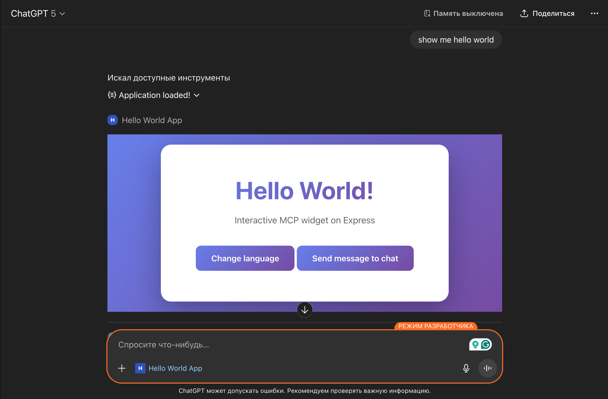

# Hello World MCP Server



## Description

This project is an MCP (Model Context Protocol) server that provides an interactive Hello World widget. The application can be run as a standalone server or integrated with ChatGPT through the MCP protocol.

### Key Features

- 🚀 MCP server on Express with SSE (Server-Sent Events) support
- 🎨 Web interface
- 📦 Frontend build via Webpack
- 🔌 Integration with OpenAI/ChatGPT through MCP protocol

## Project Structure

```
mcp-server-node/
├── dist/             # Built files (generated during build)
├── src/              # Source files
│   ├── index.js      # Entry point
│   ├── script.js     # Widget logic
│   └── style.css     # Styles
├── server.js         # Express server with MCP
├── webpack.config.js # Webpack configuration
└── package.json      # Dependencies and scripts
```

## Installation and Running

1. Install dependencies:

```bash
npm install
```

2. Create a `.env` file in the project root and set the `BASE_URL` environment variable:

```bash
BASE_URL=https://your-domain.com
```

**⚠️ Important:** The `BASE_URL` environment variable is **required** for proper static asset building. This URL is used by Webpack to generate correct paths for JavaScript and CSS files in the built HTML. Without it, the widget in ChatGPT will not be able to load its scripts and styles correctly.

For example, if you're using ngrok to expose your local server:
```bash
BASE_URL=https://your-ngrok-url.ngrok-free.app
```

3. Build the project:

```bash
npm run build
```

4. Start the server:

```bash
npm run serve
```

Server will be available at: `http://localhost:3000`

## Connecting to ChatGPT

**Note:** ChatGPT requires HTTPS for MCP connections, so `http://localhost:3000` will not work directly. To connect your local MCP server to ChatGPT, you can use **ngrok** to create an HTTPS tunnel to your local server.

## API Endpoints

- `GET /mcp` - SSE endpoint for connecting MCP clients
- `POST /mcp/messages?sessionId=...` - Endpoint for sending MCP messages
- `GET /health` - Health check endpoint
- `GET /.well-known/*` - OpenID/OAuth configuration

### Tools

- `show_hello_world` - Show interactive Hello World interface

## Technologies

- **Node.js** - Runtime environment
- **Express** - Web server
- **@modelcontextprotocol/sdk** - MCP SDK for Node.js
- **Webpack** - Module bundler
- **HTML/CSS/JavaScript** - Frontend

## License

MIT

## Author

Project created as an example of MCP server integration with OpenAI/ChatGPT.

